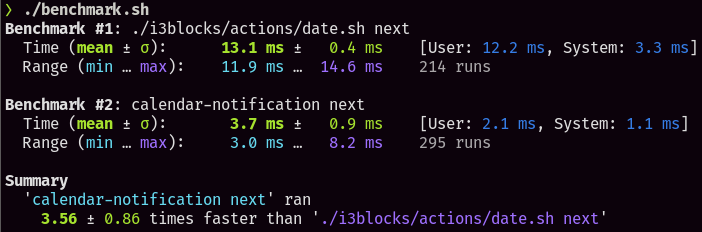

# Calendar Notification


Calendar notifications for linux desktops with performance in mind.

## Dependencies

- [cal](<https://en.m.wikipedia.org/wiki/Cal_(command)>)

## Introduction

This repo houses a rewrite of the original script in Rust to see how much of a speedup it would get.

### Usage

```sh
cargo install --path .

calendar-notification curr # Show current month
calendar-notification next # Show next month
calendar-notification prev # Show previous month
```

### Results

On running `./benchmark.sh`, the Rust variant is found to be around 1.8x faster than the shell script. A screenshot of the benchmark can be seen below.



### License

MIT
